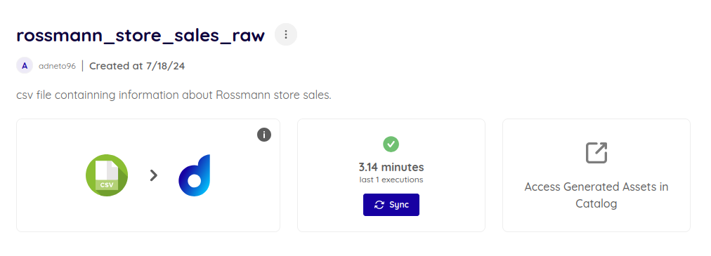

# Technology Base Case

**Item 0** - The artifact is available at this link¹. For this activity, the trello tool was used using a kanban model with the help of a checklist to monitor the development of the project. The risks of the tasks were defined by colors where green corresponds to low risk, yellow means medium risk and red means high risk.

**Item 1** - The database chosen was the data relating to Rossmann store sales available at this link².

**Item 2** - The file was loaded using the platform's import module. Some descriptive metrics were automatically added after load.

**Item 3** - After sending the static file, the platform automatically catalogs the data assets.

# References

¹ - https://trello.com/invite/b/669669f8f74e113de6bb5961/ATTIa120e089869394fd79fe5df3fb0867d9EB67BED0/case-tecnico-base-v20
² - https://www.kaggle.com/c/rossmann-store-sales/data?select=store.csv
